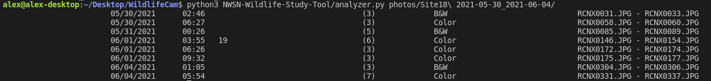

# NWSN Wildlife Study helper tool

Scan through your folder of images and pre-load some values into your excel sheet

Automatically groups series of images together and generates "Wildlife event" rows
with some columns pre-loaded.


## Setup Instructions

* Install Python 3.8 or newer: https://www.python.org/
* Download or clone this repository
* Install requirements:
    ```bash
    python3 -m pip install -r requirements.txt
    ```

## Usage

```
python3 analyzer.py PATH/TO/IMAGES
```

Output is written to an `events.csv` file. Open it in Excel and you can copy
the cells into your main report.

Disclaimer: Entries will need to be adjusted based on actual wildlife observations!


